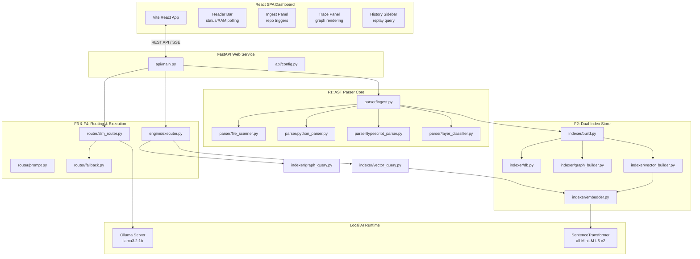

# CodeGenome-Edge — Technical Architecture & Codebase Guide

This document provides a comprehensive overview of the **CodeGenome-Edge** codebase architecture, explaining how each component is designed, which files are used where, and how data flows through the system.

---

## 1. Project Architecture Overview

**CodeGenome-Edge** is a local-only, offline-first codebase intelligence tool. It enables developers to perform natural language queries about their codebase's structural architecture (dependencies, imports, functions, classes) without sending code to cloud APIs.

### Core Architecture Philosophy
> **"The SLM decides *what to look for*. The deterministic engine decides *how to find it*. The template renderer decides *how to show it*."**

By separating intent classification (SLM) from search execution (graph + vector algorithms), the system avoids hallucination, maintains execution speed under 3 seconds on constrained hardware, and runs successfully on an air-gapped NVIDIA Jetson Orin Nano.

### High-Level System Diagram



---

## 2. Request Lifecycle (Trace Flow)

When a user submits a natural language query in the search bar:

```mermaid
sequenceDiagram
    autonumber
    actor User as Developer (Browser)
    participant UI as React UI (App.jsx)
    participant API as FastAPI (main.py)
    participant Router as SLM Router (slm_router.py)
    participant Ollama as Ollama (llama3.2:1b)
    participant Executor as Engine (executor.py)
    participant Vector as Vector Search (vector_query.py)
    participant Graph as Graph Search (graph_query.py)
    participant DB as SQLite (codegenome.db)

    User->>UI: Types query & presses Enter
    UI->>API: POST /query {"query": "..."}
    API->>Router: call_ollama(query)
    
    rect rgb(30, 30, 45)
        note right of Router: Intent Routing & Keyword Extraction
        Router->>Ollama: Chat API Request (stop words, temp 0.0)
        Ollama-->>Router: Returns JSON {"tool": "hybrid", "keywords": [...]}
        Note over Router,Ollama: (Falls back to stopwords regex if Ollama fails)
    end
    
    Router-->>API: Returns RouterDecision
    API->>API: Detect Layer Filter (backend/frontend/shared)
    API->>Executor: execute(db, embedder, decision, layer_filter)
    
    rect rgb(30, 45, 30)
        note right of Executor: Execution Engine Dispatch
        Executor->>Vector: vector_search(keywords, top_k=10, layer_filter)
        Vector->>DB: Search virtual index (or Python cosine fallback)
        DB-->>Vector: Returns matching symbols
        Vector-->>Executor: Top match chosen as "seed" symbol
        
        Executor->>Graph: graph_trace(seed.file_path, depth=3)
        Graph->>DB: BFS upstream (dependents) & downstream (dependencies)
        DB-->>Graph: Nodes matching BFS
        Graph-->>Executor: BFS trace arrays
    end
    
    Executor-->>API: Compiles canonical TraceResult
    API->>DB: INSERT INTO query_history (log trace log)
    API-->>UI: Returns TraceResult JSON
    
    rect rgb(45, 30, 45)
        note right of UI: Streaming Explanation (Async)
        UI->>API: POST /query/explain (TraceResult)
        API->>Ollama: Request explanation (Stream=True)
        Ollama-->>API: SSE Text Chunks
        API-->>UI: Text Stream Response
        UI->>User: Displays Graph & Explanation Summary
    end
```



---

## 3. Ingestion & Indexing Pipeline

Ingestion converts a raw repository path into a queryable relational database:

```
[Raw Repository Directory]
         │
         ▼
 1. parser/file_scanner.py  ──► Filters extensions (*.py, *.ts, etc.), skips ignored folders
         │
         ▼
 2. parser/python_parser.py ──► Extracts Python AST imports, classes, functions, and exports
    parser/typescript_parser.py ──► Extracts TS/JS AST nodes (ES modules, React component arrow fns)
         │
         ▼
 3. parser/layer_classifier.py ──► Tags each file (backend / frontend / shared / test)
         │
         ▼
 4. parser/ingest.py        ──► Outputs manifest.json & records errors in parse_errors.log
         │
         ▼
 5. indexer/build.py        ──► Initiates DB building sequence
         │
         ├── indexer/graph_builder.py  ──► Classifies edges (internal/external), inserts nodes/edges
         └── indexer/vector_builder.py ──► Batch-embeds symbol names via SentenceTransformer
                 │
                 ▼
          [codegenome.db]
```

---

## 4. Codebase Component & File Directory Guide

This section lists every file in the repository, detailing its role, main methods, and how it is used.

### 4.1 REST API Layer (`api/`)

*   **[api/main.py](file:///d:/repo/Edge_minds/api/main.py)**:
    *   **Purpose**: The central API gateway, built with FastAPI. It handles routing, lifespan setup (startup database checks and embedding loading), CORS settings based on the target environment, static file mounting in production, and standard error JSON responses.
    *   **Main Endpoints**:
        *   `POST /ingest`: Triggers the scanning and indexing workflow (blocking). Saves the active repo path in a `settings` table.
        *   `POST /query`: Submits queries to the SLM, runs execution path, parses layer filters (`frontend` vs `backend`), and saves execution history.
        *   `GET /status`: Live health endpoint (returns RAM usage via `psutil`, Ollama availability, and database stats). Polled by the UI every 5 seconds.
        *   `GET /files`: Retrieves list of indexed files with metadata.
        *   `GET /history`: Retrieves last 20 queries for the sidebar display.
        *   `POST /query/explain`: Streams a natural language explanation of search results using `llama3.2:1b` (StreamingResponse).
    *   **Main Dependents**: Invokes `parser.ingest`, `indexer.build`, `router.slm_router`, and `engine.executor`.
*   **[api/config.py](file:///d:/repo/Edge_minds/api/config.py)**:
    *   **Purpose**: Environment variable loader using `python-dotenv`. Exposes system-wide configurations (`OLLAMA_BASE_URL`, `DB_PATH`, `API_HOST`, `FRONTEND_STATIC_DIR`, `ENV`, etc.) as typed constants.

### 4.2 AST Parsing Core (`parser/`)

*   **[parser/file_scanner.py](file:///d:/repo/Edge_minds/parser/file_scanner.py)**:
    *   **Purpose**: Scans a codebase directory to identify files of interest.
    *   **Behavior**: Includes `*.py`, `*.ts`, `*.tsx`, `*.js`, and `*.jsx` files. Skips `.venv`, `node_modules`, `.git`, `__pycache__`, `dist`, and `build` folders, and ignores files over 500KB.
*   **[parser/ingest.py](file:///d:/repo/Edge_minds/parser/ingest.py)**:
    *   **Purpose**: The parsing orchestrator. Invokes the scanner, maps extensions to respective parsers, calls layer tagging, and outputs `index/manifest.json`. If failures occur, they are written to `index/parse_errors.log`.
*   **[parser/python_parser.py](file:///d:/repo/Edge_minds/parser/python_parser.py)**:
    *   **Purpose**: Extracts AST blueprints from Python files.
    *   **Behavior**: Uses `tree-sitter-languages` for Python grammar. Extracts imports (`import_statement`, `import_from_statement`), classes, and functions. Determines exports (all module-level functions/classes not prefixed with a leading underscore `_`). Skip function and method block bodies to preserve memory footprint.
*   **[parser/typescript_parser.py](file:///d:/repo/Edge_minds/parser/typescript_parser.py)**:
    *   **Purpose**: Extracts AST blueprints from JS/TS/JSX/TSX files.
    *   **Behavior**: Uses separate parsing pipelines for standard TS and TSX layouts. Extracts default imports, named imports, and namespace imports (`* as ns`). Captures classes, standard function declarations, class method definitions, and module-level arrow component functions (JSX variables).
*   **[parser/layer_classifier.py](file:///d:/repo/Edge_minds/parser/layer_classifier.py)**:
    *   **Purpose**: Identifies architectural layers based on a file path.
    *   **Behavior**: Maps paths containing keywords (`api/`, `models/`, `routes/`, `db/`) to `backend`; paths containing (`components/`, `pages/`, `hooks/`, `ui/`) to `frontend`; testing folders to `test`; utility modules to `shared`; and otherwise defaults to extensions (`.py` -> `backend`, `.tsx` -> `frontend`).

### 4.3 Database & Indexer (`indexer/`)

*   **[indexer/db.py](file:///d:/repo/Edge_minds/indexer/db.py)**:
    *   **Purpose**: Manages SQLite connections and table structure creation.
    *   **sqlite-vss check**: Attempts to load the `sqlite-vss` C-extension. Sets `HAS_VSS = True` on success. On failure (e.g. windows/ARM64 missing wheels), falls back gracefully.
*   **[indexer/build.py](file:///d:/repo/Edge_minds/indexer/build.py)**:
    *   **Purpose**: Connects to the database and coordinates insertion of nodes (files), edges (imports), and symbols.
*   **[indexer/graph_builder.py](file:///d:/repo/Edge_minds/indexer/graph_builder.py)**:
    *   **Purpose**: Inserts files into the `nodes` table and maps code imports to `edges`.
    *   **Import Resolution**: Resolves relative imports (e.g., Python `from ..auth import db` or TS relative pathing `./utils`) and aliases (e.g., `@/components`) against known file paths. Classifies edges as `internal` (resolves inside project) or `external` (third-party libraries like `fastapi` or `react`).
*   **[indexer/vector_builder.py](file:///d:/repo/Edge_minds/indexer/vector_builder.py)**:
    *   **Purpose**: Collects symbol names, runs batch embedding to optimize performance, and registers them. If `HAS_VSS` is true, inserts them into the virtual table `symbol_vectors`. Otherwise, dumps vectors as JSON arrays directly in the `symbols` table's `embedding` column.
*   **[indexer/embedder.py](file:///d:/repo/Edge_minds/indexer/embedder.py)**:
    *   **Purpose**: Encapsulates `sentence-transformers` loading. Implements a thread-safe singleton wrapper for `SentenceTransformer("all-MiniLM-L6-v2")` to load the model only once.
*   **[indexer/graph_query.py](file:///d:/repo/Edge_minds/indexer/graph_query.py)**:
    *   **Purpose**: Graph search routines. Implements a BFS search upstream (dependents) and downstream (dependencies). Standardized depth limit is capped at 3 hops.
*   **[indexer/vector_query.py](file:///d:/repo/Edge_minds/indexer/vector_query.py)**:
    *   **Purpose**: Locates symbols semantically closest to parsed search keywords.
    *   **Dual Search Mechanism**:
        *   *VSS Route*: Invokes SQLite `vss_search()` on `symbol_vectors`.
        *   *Python Fallback Route*: Loads registered embeddings from SQLite and uses `numpy` (if installed) or a pure-math Python calculation to compute cosine similarity.
    *   **Similarity Threshold**: Results below `0.35` similarity (distance > 0.65) are discarded. Filters files matching the optional `layer_filter`.

### 4.4 Intent Classifier Router (`router/`)

*   **[router/slm_router.py](file:///d:/repo/Edge_minds/router/slm_router.py)**:
    *   **Purpose**: Interacts with the local Ollama daemon. Constructs prompts, instructs the model to return JSON formatting, and sets low temperatures (`0.0`) for deterministic responses. Also runs fallback keyword extraction if Ollama is unreachable, slow, or gives malformed JSON.
    *   **Deterministic Classifier Rules**: To guarantee routing accuracy, the tool classification is governed by rules:
        *   `hybrid`: Asking about code changes/impact (`breaks`, `change`, `impact`), or when both finding and dependency terms are used.
        *   `graph`: Explicitly asking about relationships, imports, and dependencies (without locating terms).
        *   `vector`: Specifically finding, locating, or referencing a specific function/class name.
*   **[router/prompt.py](file:///d:/repo/Edge_minds/router/prompt.py)**:
    *   **Purpose**: Stores the routing system instructions. Guides the model to output a strict JSON layout: `{"tool": "...", "keywords": ["...", "..."]}`.
*   **[router/fallback.py](file:///d:/repo/Edge_minds/router/fallback.py)**:
    *   **Purpose**: Processes keyword extraction if Ollama fails. Tokenizes the search string, filters out common stopwords (`where`, `how`, `does`, etc.), and extracts the top 5 keywords. Appends fallback events to `logs/router_fallback.log`.

### 4.5 Query Execution Engine (`engine/`)

*   **[engine/executor.py](file:///d:/repo/Edge_minds/engine/executor.py)**:
    *   **Purpose**: Orchestrates searches based on the `RouterDecision`.
    *   **Tool Executions**:
        *   `vector`: Runs `vector_search` for up to 10 symbols. Skip graph query.
        *   `graph`: Runs vector search (top_k=1) to select a file as seed node, then traverses dependencies and dependents from that seed.
        *   `hybrid`: Runs vector search to select a seed, executes graph BFS, and appends all semantic symbol matches.

### 4.6 Frontend Web UI (`frontend/`)

*   **[frontend/src/App.jsx](file:///d:/repo/Edge_minds/frontend/src/App.jsx)**:
    *   **Purpose**: State hub. Handles status bar polling, keyword query submittals, sidebar search replaying, and UI layout orchestration.
*   **[frontend/src/api.js](file:///d:/repo/Edge_minds/frontend/src/api.js)**:
    *   **Purpose**: Connection layer. Uses standard `fetch()` and processes readable stream reader chunks for server explanation text.
*   **[frontend/src/components/Header.jsx](file:///d:/repo/Edge_minds/frontend/src/components/Header.jsx)**:
    *   **Purpose**: Top bar. Renders status dots for Ollama availability, badges matching the active environment (`DEV` vs `PROD`), and live RAM metrics.
*   **[frontend/src/components/IngestPanel.jsx](file:///d:/repo/Edge_minds/frontend/src/components/IngestPanel.jsx)**:
    *   **Purpose**: Retractable panel to submit repository paths for ingestion.
*   **[frontend/src/components/HistorySidebar.jsx](file:///d:/repo/Edge_minds/frontend/src/components/HistorySidebar.jsx)**:
    *   **Purpose**: Displays the list of the last 20 queries, enabling users to re-render trace results instantly without hitting the model.
*   **[frontend/src/components/TracePanel.jsx](file:///d:/repo/Edge_minds/frontend/src/components/TracePanel.jsx)**:
    *   **Purpose**: Layout panel. Visualizes search results: the selected seed node, dependents lists grouped by hop counts, dependencies lists, matching symbols, and the streaming explanation box.

---

## 5. Database Schema Details

The application stores all files, edges, embeddings, and search history in a single SQLite file (`DB_PATH`).

```sql
-- 1. NODES TABLE (Stores file details and structure)
CREATE TABLE nodes (
    id INTEGER PRIMARY KEY AUTOINCREMENT,
    file_path TEXT UNIQUE NOT NULL,
    language TEXT NOT NULL,
    functions TEXT,     -- JSON Array of strings (names only)
    classes TEXT,       -- JSON Array of strings (names only)
    exports TEXT,       -- JSON Array of strings (names only)
    layer TEXT DEFAULT 'unknown' -- backend | frontend | shared | test
);

-- 2. EDGES TABLE (Stores import relationships)
CREATE TABLE edges (
    id INTEGER PRIMARY KEY AUTOINCREMENT,
    source_file TEXT NOT NULL,
    target_name TEXT NOT NULL,
    import_type TEXT NOT NULL  -- 'internal' | 'external'
);
CREATE INDEX idx_edges_source ON edges(source_file);
CREATE INDEX idx_edges_target ON edges(target_name);

-- 3. SYMBOLS TABLE (Stores symbol records and embeddings for python fallback)
CREATE TABLE symbols (
    id INTEGER PRIMARY KEY AUTOINCREMENT,
    file_path TEXT NOT NULL,
    name TEXT NOT NULL,
    kind TEXT NOT NULL,        -- 'function' | 'class' | 'export'
    language TEXT NOT NULL,
    layer TEXT DEFAULT 'unknown',
    embedding TEXT             -- JSON array of 384 floats (used in Python fallback search)
);
CREATE INDEX idx_symbols_name ON symbols(name);
CREATE INDEX idx_symbols_file ON symbols(file_path);

-- 4. SETTINGS TABLE (Stores current workspace configurations)
CREATE TABLE settings (
    key TEXT PRIMARY KEY,
    value TEXT
);

-- 5. QUERY HISTORY TABLE (Stores query history records)
CREATE TABLE query_history (
    id INTEGER PRIMARY KEY AUTOINCREMENT,
    query TEXT NOT NULL,
    tool_used TEXT,
    routed_by TEXT,
    seed_file TEXT,
    result_json TEXT,          -- Full TraceResult JSON blob
    execution_ms INTEGER,
    created_at TEXT DEFAULT CURRENT_TIMESTAMP
);

-- 6. SYMBOL VECTORS VIRTUAL TABLE (SQLite-VSS index, enabled only if extension loads)
CREATE VIRTUAL TABLE symbol_vectors USING vss0(
    embedding(384)
);
```

---

## 6. Core Data Models

### Ingest Manifest Blueprint (`FileBlueprint`)
Generated by the parser layer (`manifest.json`) and ingested by the database builder:
```typescript
interface FileBlueprint {
  file_path: string;
  language: "python" | "javascript" | "typescript";
  imports: Array<{ module: string; names: string[] }>;
  exports: string[];
  functions: string[];
  classes: string[];
  layer: "backend" | "frontend" | "shared" | "test" | "unknown";
}
```

### SLM Router Output (`RouterDecision`)
Returned by `router/slm_router.py` to identify search intent:
```typescript
interface RouterDecision {
  tool: "graph" | "vector" | "hybrid";
  keywords: string[];
  routed_by: "slm" | "fallback";
  slm_raw: string;
  latency_ms: number;
}
```

### Server API Payload (`TraceResult`)
The canonical response returned from the execution engine:
```typescript
interface TraceResult {
  query: string;
  routed_by: "slm" | "fallback";
  tool_used: "graph" | "vector" | "hybrid";
  keywords: string[];
  layer_filter: "backend" | "frontend" | null;
  slm_latency_ms: number;
  seed: {
    file_path: string;
    symbol: string;
    kind: "function" | "class" | "export";
    layer: string;
    similarity: number;
  } | null;
  symbol_matches: Array<{
    name: string;
    file_path: string;
    kind: string;
    layer: string;
    similarity: number;
  }>;
  dependents: Array<{ file_path: string; hop: number }>;
  dependencies: Array<{ file_path: string; hop: number }>;
  depth_capped: boolean;
  no_match: boolean;
  execution_ms: number;
}
```

---

## 7. Environment & Deployment Strategy

The application is structured to run in both local development environments and hardware-constrained production environments:

| Concern | Dev Environment | Prod (NVIDIA Jetson) |
|---|---|---|
| **Host IP / Port** | `127.0.0.1:8000` | `0.0.0.0:8000` (LAN accessible) |
| **CORS Rules** | Restricted to `localhost:5173` | Allowed for local network subnet |
| **Frontend Serving** | Vite Dev Server | Static `dist/` built files served directly by FastAPI |
| **Ollama Model** | `llama3.2:1b` (default configs) | Tuned: single thread (`NUM_PARALLEL=1`), loaded into GPU memory |
| **sqlite-vss Loader** | Standard wheel loaded via python pip | Compiled from source (`vss0.so`) due to lack of ARM64 wheels |
| **Memory Management** | Unrestricted | Cron watchdogs monitor RAM and restart API if usage exceeds 3.7GB |

---

## 8. Test Suite & Verification

The codebase includes a comprehensive test suite in the `tests/` directory:

1.  **[tests/test_parser.py](file:///d:/repo/Edge_minds/tests/test_parser.py)**: Validates tree-sitter AST extraction routines. Tests that imports, class definitions, function structures, and ES variables are captured correctly.
2.  **[tests/test_layer.py](file:///d:/repo/Edge_minds/tests/test_layer.py)**: Asserts correct layer classification (backend, frontend, shared, test, unknown) for various folder path patterns.
3.  **[tests/test_graph.py](file:///d:/repo/Edge_minds/tests/test_graph.py)**: Mocks a workspace database, runs BFS traversals, validates depth caps, and asserts dependent/dependency hop arrays.
4.  **[tests/test_vector.py](file:///d:/repo/Edge_minds/tests/test_vector.py)**: Asserts cosine similarity algorithms and tests database loading fallbacks (virtual SQLite-VSS queries vs Python math searches).
5.  **[tests/test_router.py](file:///d:/repo/Edge_minds/tests/test_router.py)**: Runs a 20-query routing benchmark suite checking intent classification accuracy (expected gate: >= 85%).
6.  **[tests/test_executor.py](file:///d:/repo/Edge_minds/tests/test_executor.py)**: Verifies the execution flow pathing and edge case scenarios (no matches found, depth limits hit, or empty results).
7.  **[tests/test_api.py](file:///d:/repo/Edge_minds/tests/test_api.py)**: Simulates mock API requests utilizing FastAPI's `TestClient` to verify endpoints.
